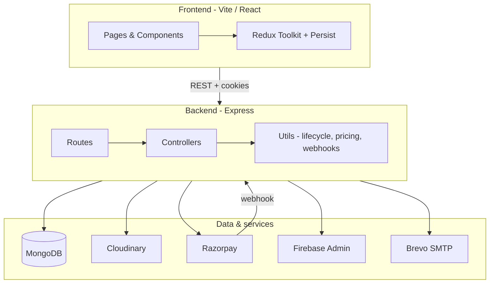

# Sportsync — Technical Documentation

Sportsync is a full-stack **sports e-commerce** platform: customers browse gear by category, manage cart and wishlist, checkout with **COD** or **Razorpay**, track orders, request returns, and leave reviews. Admins manage products, categories, users, orders, and delivery pricing from a dashboard.

---

## Table of contents

1. [Architecture overview](#1-architecture-overview)
2. [Technology stack](#2-technology-stack)
3. [Repository structure](#3-repository-structure)
4. [Getting started](#4-getting-started)
5. [Environment variables](#5-environment-variables)
6. [Authentication & authorization](#6-authentication--authorization)
7. [Data models](#7-data-models)
8. [API reference](#8-api-reference)
9. [Order lifecycle & returns](#9-order-lifecycle--returns)
10. [Payments (Razorpay)](#10-payments-razorpay)
11. [Pricing & delivery fees](#11-pricing--delivery-fees)
12. [Frontend application](#12-frontend-application)
13. [Admin dashboard](#13-admin-dashboard)
14. [Media & file uploads](#14-media--file-uploads)
15. [Email & notifications](#15-email--notifications)
16. [Deployment notes](#16-deployment-notes)
17. [Scripts & seeding](#17-scripts--seeding)
18. [Known behaviors & quirks](#18-known-behaviors--quirks)

---

## 1. Architecture overview

The app is split into a **React SPA** (Vite) and an **Express REST API** (MongoDB). The frontend talks to the API over HTTPS with **cookie-based JWT** sessions. Razorpay handles online payments; Firebase powers Google sign-in on the client with token verification on the server.



### Typical request flow (logged-in checkout)

1. User adds items → `POST /api/cart/addToCart/:productId`
2. Checkout loads cart → `GET /api/cart/getcart/:userId`
3. User selects address (stored via user/address APIs)
4. **COD:** `POST /api/orders/create` → cart lines cleared → success page  
5. **Online:** `POST /api/payment/createpayment` → Razorpay modal → `POST /api/payment/verifypayment` (+ optional polling) → cart cleared → success page

---

## 2. Technology stack

| Layer | Technologies |
|--------|----------------|
| **Frontend** | React 18, Vite 5, React Router 6, Redux Toolkit, Redux Persist, Tailwind CSS, Framer Motion, React Hot Toast, Firebase Auth (client), Axios |
| **Backend** | Node.js, Express 4, Mongoose 8, JWT (httpOnly cookies), Firebase Admin, Razorpay SDK, Cloudinary + Multer, Nodemailer |
| **Database** | MongoDB |
| **Payments** | Razorpay (orders, capture, refunds, webhooks) |

---

## 3. Repository structure

```
Sportsync/
├── DOCUMENTATION.md          # This file
├── backend/
│   ├── index.js              # Express app entry, CORS, Razorpay, Firebase Admin
│   ├── config/db.js          # MongoDB connection
│   ├── controllers/          # Route handlers
│   ├── models/               # Mongoose schemas
│   ├── routes/               # Express routers
│   ├── utils/                # Cross-cutting logic (lifecycle, pricing, webhooks, email)
│   ├── seed/                 # Category/product seed data
│   ├── scripts/bulkImport.js # DB bulk import utility
│   └── PAYMENTS.md           # Razorpay production checklist
├── frontend/
│   ├── src/
│   │   ├── App.jsx           # Routes
│   │   ├── main.jsx          # Redux Provider, ThemeProvider
│   │   ├── components/       # UI building blocks
│   │   ├── pages/            # Route pages (shop, auth, admin, user)
│   │   ├── redux/slices/     # Client state
│   │   ├── contexts/         # ThemeContext
│   │   ├── utils/            # orderStatus, api, sortProducts
│   │   ├── constants/        # authRingAssets, shopCategories
│   │   └── firebase.js       # Firebase client config
│   ├── public/               # Static assets (LOGO, auth carousel PNGs)
│   └── vercel.json           # SPA rewrites for hosting
```

---

## 4. Getting started

### Prerequisites

- Node.js 18+
- MongoDB instance (local or Atlas)
- Razorpay account (test/live keys)
- Firebase project (Google sign-in + Admin SDK JSON)
- Cloudinary account (product/category images)
- SMTP credentials (Brevo recommended for OTP emails)

### Backend

```bash
cd backend
npm install
# Create .env (see section 5)
npm run dev    # nodemon
# or
npm start
```

Default port: **5000** (`PORT` env).

### Frontend

```bash
cd frontend
npm install
# Create .env (see section 5)
npm run dev    # Vite, typically http://localhost:5173
```

Build for production:

```bash
npm run build   # output: frontend/dist
```

Point `VITE_PORT` at your API base URL (e.g. `http://localhost:5000`).

---

## 5. Environment variables

### Backend (`backend/.env`)

| Variable | Required | Description |
|----------|----------|-------------|
| `MONGO_URI` | Yes | MongoDB connection string |
| `PORT` | No | Server port (default `5000`) |
| `JWT_SECRET` | Yes | Signs `access_token` cookie |
| `CLIENT` | Yes | Frontend origin for CORS (e.g. `http://localhost:5173`) |
| `RAZORPAY_API_KEY` | Yes | Razorpay key id |
| `RAZORPAY_API_SECRET` | Yes | Razorpay secret |
| `WEBHOOK_SECRET` | Yes (prod) | Razorpay webhook signature secret |
| `FIREBASE_ADMINSDK_BASE64` | Yes | Base64-encoded Firebase service account JSON |
| `BREVO_API_KEY` | For OTP (production) | Brevo **API key** (HTTPS — required on Render; SMTP ports are blocked) |
| `BREVO_SENDER_EMAIL` | For OTP | Verified sender in Brevo (default `sportsync98@gmail.com`) |
| `BREVO_SMTP_USER` | Local dev only | SMTP login (optional if using `EMAIL_TRANSPORT=smtp`) |
| `BREVO_SMTP_KEY` | Local dev only | SMTP password |
| `ADMIN_ALERT_EMAIL` | Optional | Email for payment/refund alert failures |

See also `backend/PAYMENTS.md` for Razorpay dashboard setup.

### Frontend (`frontend/.env`)

| Variable | Description |
|----------|-------------|
| `VITE_PORT` | **API base URL** (e.g. `http://localhost:5000` or production API) |
| `VITE_FIREBASE_API_KEY` | Firebase web config |
| `VITE_FIREBASE_AUTH_DOMAIN` | |
| `VITE_FIREBASE_PROJECT_ID` | |
| `VITE_FIREBASE_STORAGE_BUCKET` | |
| `VITE_FIREBASE_MESSAGING_SENDER_ID` | |
| `VITE_FIREBASE_APP_ID` | |
| `VITE_FIREBASE_MEASUREMENT_ID` | Optional analytics |

---

## 6. Authentication & authorization

### Methods

1. **Email + password** — `POST /api/auth/signin` (bcrypt, JWT cookie)
2. **Email OTP signup** — `POST /api/auth/send-otp` → `POST /api/auth/verify-otp-signup`
3. **Google (Firebase)** — Client `signInWithPopup` → `POST /api/auth/firebasesignin` with ID token
4. **Forgot password** — OTP via email → `POST /api/auth/forgot-password-reset`

### Session

- JWT stored in **`access_token` httpOnly cookie** (`sameSite: none`, `secure: true` in auth flows)
- Middleware: `verifyUser` reads cookie, sets `req.user` (`id`, `userType`, etc.)
- Admin routes use `verifyToken` + `verifyAdmin` (`userType === 'admin'`)

### Frontend guards

| Component | Behavior |
|-----------|----------|
| `PrivateRoute` | Requires `currentUser` in Redux; else redirect `/signin` |
| `OnlyAdminPrivateRoute` | Requires admin user; else redirect home/sign-in |

### Guest cart

- Logged-out users store cart in **localStorage** via Redux (`addToCartGuest`)
- On login, server cart is authoritative when they use authenticated add/fetch APIs

---

## 7. Data models

### User (`User`)

- Profile: `firstName`, `lastName`, `email`, `phone`, `password` (optional if Firebase-only)
- `firebaseUid` (sparse unique), `userType`: `customer` | `admin`
- `wishlist`: array of `Product` refs

### Product (`Product`)

- `name`, `slug`, `brand`, `price`, `discountPrice`, `description`
- `image[]` (URLs/paths, often Cloudinary), `coverImageIndex`
- `sizes[]`, `colors[]` — variant options for cart/checkout
- `stock`, `rating`, `reviewsCount`, `featured`, `isActive`
- `categoryId`, `categoryName`

### Category (`Category`)

- `name`, `image[]`, optional `products[]` refs

### Cart (`Cart` + `CartItem`)

- **Cart:** one per `userId`, holds `cartItems[]` refs
- **CartItem:** `productId`, `quantity`, `size`, `color`

### Order (`Order`)

- `userId`, `products[]` line items: `productId`, `quantity`, `unitPriceAtPurchase`, `size`, `color`
- `totalAmount`, `paymentMethod` (`cod` | `online`), `address` snapshot
- `status` (see [Order lifecycle](#9-order-lifecycle--returns))
- Return/refund fields: `returnRequestedAt`, `returnApprovedAt`, `returnPickupScheduledAt`, `returnPickedUpAt`, `returnReason`, `refundProcessedAt`, `refundNote`, `razorpayRefundId`, `refundStatus`
- `expectedDeliveryDate`, `deliveredAt`, `razorpay_order_id`, `paymentId` ref

### Payment (`Payment`)

- Razorpay ids, amount, method, link to order

### Review (`Review`)

- Tied to `productId`, `orderId`, `userId`, rating, comment

### Settings (`Settings`)

- `key: "pricing"`, `deliveryCharge` (number, default 0)

### Other

- `Address`, `OtpVerification`, `WebhookEvent`, `PaymentAlert`, `Admin`

---

## 8. API reference

Base URL: `{VITE_PORT}` / `{API_HOST}`  
Auth: unless noted, protected routes expect `access_token` cookie.

### Auth — `/api/auth`

| Method | Path | Auth | Description |
|--------|------|------|-------------|
| POST | `/signin` | No | Email/password login |
| POST | `/signup` | No | Legacy password signup |
| POST | `/send-otp` | No | Send signup OTP email |
| POST | `/verify-otp-signup` | No | Verify OTP and create account |
| POST | `/firebasesignin` | No | Google login/register |
| POST | `/addphone` | No* | Attach phone to user |
| POST | `/forgot-password-send-otp` | No | Password reset OTP |
| POST | `/forgot-password-reset` | No | Reset password with OTP |
| POST | `/checkuser` | No | Check if phone exists |

### User — `/api/user`

| Method | Path | Description |
|--------|------|-------------|
| GET | `/getusers` | List users (admin usage) |
| DELETE | `/delete/:userId` | Delete user |
| POST | `/signout` | Clear auth cookie |
| POST | `/createaddress/:userId` | Add address |
| GET | `/address/:userId` | List addresses |
| DELETE | `/deleteaddress/:addressId` | Remove address |

### Products — `/api/products`

| Method | Path | Description |
|--------|------|-------------|
| GET | `/getAllproducts` | Paginated list (`page`, `limit`, `sort`) |
| GET | `/getbyId/:productId` | Single product (+ review eligibility if `userId` query) |
| GET | `/getProductsByCategory/:categoryId` | Filter by category id or name |
| GET | `/search/:q` | Search with pagination |
| GET | `/related/:productId` | Related products (`?tab=recommended\|category\|classic\|more`) |
| GET | `/similar/:productId` | Alias → related |
| POST | `/create` | Create product (multipart images) |
| PUT | `/update/:productId` | Update product |
| DELETE | `/delete/:productId` | Delete product |
| PUT | `/updateimg/:productId` | Replace images |

### Categories — `/api/categories`

| Method | Path | Description |
|--------|------|-------------|
| GET | `/getAllcategory` | All categories (optional `page`) |
| GET | `/getbyId/:categoryId` | One category |
| POST | `/create` | Create category |
| PUT | `/update/:categoryId` | Update name |
| DELETE | `/delete/:categoryId` | Delete category + its products |
| PUT | `/updateimg/:categoryId` | Upload category images |
| PUT | `/removeImage/:categoryId` | Remove one image |

### Cart — `/api/cart`

| Method | Path | Description |
|--------|------|-------------|
| GET | `/getcart/:userId` | Cart with populated products |
| POST | `/addToCart/:productId` | Body: `{ userId, size?, color? }` |
| PUT | `/update/:cartItemId` | Body: `{ quantity }` |
| DELETE | `/delete/:cartItemId` | Remove line item |

### Orders — `/api/orders`

| Method | Path | Auth | Description |
|--------|------|------|-------------|
| POST | `/create` | User | Create COD (or direct) order |
| GET | `/getorders/:userId` | User | Customer order history |
| GET | `/getorder/:orderId` | User | Single order |
| PATCH | `/cancel/:orderId` | User | Cancel before delivery |
| POST | `/:orderId/return` | User | Request return |
| PATCH | `/:orderId/return/cancel` | User | Cancel return (pre-pickup) |
| GET | `/getadminorders` | Admin | All orders (paginated) |
| PATCH | `/updatestatus/:orderId` | Admin | Manual status update |

### Payment — `/api/payment`

| Method | Path | Auth | Description |
|--------|------|------|-------------|
| POST | `/createpayment` | User | Create Razorpay order + DB `payment_pending` order |
| POST | `/verifypayment` | User | Verify signature after checkout |
| POST | `/webhook` | No | Duplicate of root webhook (prefer `/api/webhook`) |

### Global payment helpers

| Method | Path | Description |
|--------|------|-------------|
| POST | `/api/webhook` | Razorpay webhook (signature verified) |
| GET | `/api/getkey` | Returns `RAZORPAY_API_KEY` for client checkout |

### Reviews — `/api/reviews`

| Method | Path | Description |
|--------|------|-------------|
| GET | `/product/:productId` | Paginated reviews (`page`, `limit`) |
| POST | `/order/:orderId` | Submit review for product on delivered order |

### Wishlist — `/api/wishlist`

| Method | Path | Description |
|--------|------|-------------|
| GET | `/:userId` | List wishlist products |
| POST | `/add` | Body: `{ userId, productId }` |
| POST | `/remove` | Body: `{ userId, productId }` |

### Settings — `/api/settings`

| Method | Path | Description |
|--------|------|-------------|
| GET | `/pricing` | `{ deliveryCharge }` |
| PUT | `/pricing` | Body: `{ deliveryCharge }` |

### Admin — `/api/admin` (admin JWT)

| Method | Path | Description |
|--------|------|-------------|
| GET/POST/DELETE | `/` | Admin user CRUD |
| GET | `/payment-alerts` | Failed payment/refund alerts |
| PATCH | `/payment-alerts/:alertId/resolve` | Resolve alert |

---

## 9. Order lifecycle & returns

Logic lives in `backend/utils/orderLifecycle.js` and runs when orders are **fetched** (`applyOrderLifecycle`).

### Fulfillment (auto-forward, 24h from order time)

| Time after order | Status |
|------------------|--------|
| 0–2h | `confirmed` |
| 2–8h | `processing` |
| 8–18h | `shipped` |
| 18–24h | `out_for_delivery` |
| 24h+ | `delivered` |

- Status **never auto-downgrades** (manual admin updates are preserved).
- `expectedDeliveryDate` = order time + 24 hours.

### Cancellable (customer)

Before delivery completes: `confirmed`, `processing`, `shipped`, `out_for_delivery`, `pending`.

### Returns (after `delivered`)

- **Window:** 15 days from delivery
- Flow: `return_requested` → `return_approved` (+2h) → `return_pickup_scheduled` (+4h from approval) → `return_picked_up` (+12h) → refund processing → `refunded`
- Customer UI shows **pickup date** when status is `return_pickup_scheduled` (`frontend/src/utils/orderStatus.js`)
- Return can be cancelled while status is `return_requested`, `return_approved`, or `return_pickup_scheduled`

### Frontend status helpers

`frontend/src/utils/orderStatus.js` — labels, colors, delivery estimate display, return pickup copy.

---

## 10. Payments (Razorpay)

### COD

1. Server creates order with `status: confirmed`, `paymentMethod: cod`
2. Prices computed from **current product DB price** × quantity + delivery rules

### Online

1. `createpayment` — server recalculates total, creates Razorpay order, saves `payment_pending` order
2. Client opens Razorpay checkout with `order_id` from response
3. `verifypayment` — HMAC signature check, marks order confirmed, links payment
4. **Webhook** (`/api/webhook`) — idempotent processing via `WebhookEvent` collection; handles capture, failures, refunds

### Security

- Protected payment routes require JWT cookie
- Webhook verifies `x-razorpay-signature` with `WEBHOOK_SECRET`
- Client total must match server total (±₹1 tolerance)

Full production checklist: **`backend/PAYMENTS.md`**.

---

## 11. Pricing & delivery fees

### Product price

- Stored on `Product.price` — **no making charge**; displayed and charged as-is everywhere (listings, cart, orders).

### Delivery charge

- **Admin setting:** `Settings.deliveryCharge` via `/api/settings/pricing`
- **Server (Razorpay orders):** `computeOrderTotal` in `paymentController.js` — adds delivery fee if subtotal &gt; 0 and **&lt; ₹499**
- **Checkout UI:** Currently hardcodes **₹49** delivery when subtotal &lt; ₹499 (should be aligned with settings API for consistency)

Free delivery when cart subtotal ≥ ₹499.

---

## 12. Frontend application

### Routing (`App.jsx`)

| Path | Access | Page |
|------|--------|------|
| `/` | Public | Home |
| `/signin`, `/signup`, `/forgot-password` | Public | Auth overlays on Home |
| `/products/:productId` | Public | Product detail |
| `/categories/:categoryId` | Public | Products in category |
| `/category/:categoryName`, `/explore` | Public | Category browse |
| `/search` | Public | Search + filters |
| `/cart`, `/checkout`, `/profile`, `/wishlist`, `/paymentsuccess` | Private | Logged-in |
| `/dashboard/*` | Admin | Admin panel (`?tab=`) |
| `/about`, `/faq`, `/privacy`, `/terms` | Public | Content |

### Redux slices

| Slice | Purpose |
|-------|---------|
| `user` | `currentUser`, auth actions |
| `cart` | Cart items, guest localStorage sync |
| `wishlist` | Wishlist ids / server sync |
| `product` | Admin product list state |
| `category` | Category list for admin |
| `order` | Order fetch helpers |
| `address` | Address management |
| `search` | Search results state |
| `trending` | Home trending section |

Persisted to `localStorage` via **redux-persist** (entire root reducer).

### Key UX features

- **Theme** — `ThemeContext` (light/dark)
- **Offline** — `OfflineOverlay` + `useNetworkStatus`
- **Auth modal** — `AuthModalVisual` + `AuthRingGallery` (sports category carousel)
- **Pagination** — shared `Pagination` component (search, reviews)
- **WhatsApp** — `FloatingWhatsApp` floating CTA

### API client

- Most calls: `fetch(\`${import.meta.env.VITE_PORT}/api/...\`)` with `credentials: 'include'` where needed
- Checkout/payment: `utils/api.js` Axios instance with `withCredentials: true`

---

## 13. Admin dashboard

URL: `/dashboard?tab=<tab>`

| Tab | Component | Capabilities |
|-----|-----------|----------------|
| `products` | `Product.jsx` | CRUD products, delivery charge setting, pagination |
| `product-update` | `ProductUpdate.jsx` | Edit single product |
| `categories` | `Category.jsx` | CRUD categories, images |
| `category-update` | `CategoryUpdate.jsx` | Edit category |
| `orders` | `Order.jsx` | All orders, status updates, payment alerts |
| `users` | `Users.jsx` | User list/delete |

Sidebar: `DashSidebar.jsx`.

---

## 14. Media & file uploads

- **Multer + Cloudinary** (`backend/utils/multer.js`) for product/category uploads
- Local fallback paths under `frontend/public` for legacy filenames
- API also serves `frontend/public` statically for `/images` and root static files
- Product images: up to **4** per product; categories up to **3**

---

## 15. Email & notifications

`backend/utils/emailService.js` — Nodemailer via Brevo SMTP:

- OTP for signup and password reset
- Admin alerts for payment/refund failures (`paymentAlerts.js`)

Requires `BREVO_API_KEY` on production (Render). Optionally `BREVO_SMTP_*` for local SMTP. Set `ADMIN_ALERT_EMAIL` for payment alerts.

---

## 16. Deployment notes

### Typical setup

| Service | Role |
|---------|------|
| **Vercel** (or similar) | Host `frontend` SPA (`vercel.json` rewrites to `index.html`) |
| **Render** (or similar) | Host `backend` Node server |
| **MongoDB Atlas** | Database |
| **Cloudinary** | Image CDN |
| **Razorpay** | Payments (live keys + webhook URL to API) |

### CORS

`backend/index.js` allows:

- `localhost` and `ngrok-free.dev` origins
- Explicit production URLs (update for your Sportsync domains)
- `process.env.CLIENT`

Add your production frontend URL to the allowlist when deploying.

### Webhook URL

Register in Razorpay: `https://<your-api-domain>/api/webhook`

---

## 17. Scripts & seeding

| Script | Command | Purpose |
|--------|---------|---------|
| Bulk import | `node backend/scripts/bulkImport.js` | Import seed categories/products |
| Seed data | `backend/seed/categories.js`, `products.js` | Static catalog definitions |

---

## 18. Known behaviors & quirks

1. **Order auto-status** — Progresses on **read** (fetch orders), not a background cron. Heavy reliance on customers/admins opening order pages.
2. **Checkout vs server delivery fee** — Checkout may use ₹49 hardcoded while payment API uses DB `deliveryCharge`; align these if totals disagree.
3. **Legacy CORS / branding** — `index.js` may still list old Silverwale domains; update for Sportsync production URLs.
4. **Cart routes** — `cartRoute.js` may register duplicate legacy routes (`/remove`, `/update/:id`); active frontend only uses `delete/:cartItemId` and `update/:cartItemId`.
5. **Guest vs server cart** — Guest cart is local-only until login; merging on login is not automatic.
6. **Admin product price** — Admin forms edit raw `price`; no separate “base” vs “display” price after making-charge removal.
7. **`index.js` static `client/dist`** — Serves `backend/client/dist` if present; primary frontend deploy is usually separate (Vercel).

---

## Related files quick index

| Topic | Location |
|-------|----------|
| Order lifecycle | `backend/utils/orderLifecycle.js` |
| Refunds | `backend/utils/refundService.js` |
| Webhooks | `backend/utils/webhookProcessor.js` |
| Pricing | `backend/utils/pricing.js` |
| Order status UI | `frontend/src/utils/orderStatus.js` |
| Payments guide | `backend/PAYMENTS.md` |

---

*Last updated to reflect the Sportsync codebase: sports variants (size/color), no making charge, Razorpay + COD checkout, and automated order/return lifecycle.*

---

## 19. CHAPTER 5: Testing

### 5.1 Testing Strategy

Sportsync testing uses a layered approach:

1. **Unit tests** validate isolated controller and reducer behavior.
2. **Integration tests** validate route + middleware + controller interaction.
3. **System-level checks** validate complete user journeys through combined modules.
4. **Security validation tests** verify access control (`verifyToken`, `verifyAdmin`) and protected-route behavior.

Current automated stack:

- **Backend:** Jest + Supertest (`backend`)
- **Frontend:** Vitest (`frontend`)

Run all available tests:

```bash
npm --prefix backend test
npm --prefix frontend test
```

### 5.2 Unit Testing

Implemented unit test files:

- `backend/tests/authController.test.js`
- `backend/tests/cartController.test.js`
- `backend/tests/productController.test.js`
- `backend/tests/categoryController.test.js`
- `backend/tests/orderController.test.js`
- `backend/tests/paymentController.test.js`
- `backend/tests/securityMiddleware.test.js`
- `backend/tests/orderRoute.integration.test.js` (route-level integration for auth/admin order endpoint)
- `frontend/src/redux/slices/userSlice.test.js`
- `frontend/src/redux/slices/productCategorySlice.test.js`
- `frontend/src/redux/slices/cartSlice.test.js`
- `frontend/src/redux/slices/orderSecurityPayment.test.js`

**Figure 5.1 Unit Testing Output**

Latest run summary:

- Backend: **8/8 suites passed**, **16/16 tests passed**
- Frontend: **4/4 files passed**, **11/11 tests passed**

### 5.3 Integration Testing

Implemented integration test file:

- `backend/tests/orderRoute.integration.test.js`

Coverage includes:

- access to `GET /api/orders/getadminorders` without token (`401`)
- access to `GET /api/orders/getadminorders` as non-admin (`403`)
- successful admin endpoint access when token and role checks pass (`200`)

**Figure 5.2 Integration Testing Output**

Integration result is included in backend test summary with all cases passing.

### 5.4 System Testing

System behavior is currently validated by combining module-level and route-level tests across:

- login/auth flow (signin validation and success),
- product/category behaviors,
- cart quantity and missing-item cases,
- payment request validation and payment verification validation,
- order cancellation error path,
- security middleware checks.

**Figure 5.3 System Testing Result**

System-level regression status: **Pass** for the currently automated scenarios.

### 5.5 Test Cases and Results

#### Table 5.1 Login Module Test Cases

| Test Case ID | Scenario | Expected Result | Status | Automated File |
|---|---|---|---|---|
| LOGIN-01 | Signin with missing email/password | Request rejected with validation error | Pass | `backend/tests/authController.test.js` |
| LOGIN-02 | Signin with valid credentials | JWT cookie set and user payload returned | Pass | `backend/tests/authController.test.js` |
| LOGIN-03 | User slice sign-in start state | `loading=true`, no stale error | Pass | `frontend/src/redux/slices/userSlice.test.js` |
| LOGIN-04 | User slice sign-in success state | `currentUser` updated, `loading=false` | Pass | `frontend/src/redux/slices/userSlice.test.js` |

#### Table 5.2 Product Management Test Cases

| Test Case ID | Scenario | Expected Result | Status | Automated File |
|---|---|---|---|---|
| PROD-01 | Fetch missing product by ID | API returns `404 Product not found` | Pass | `backend/tests/productController.test.js` |
| PROD-02 | Create category with empty name | API returns `400 Category name is required` | Pass | `backend/tests/categoryController.test.js` |
| PROD-03 | Create category with duplicate name | API returns duplicate-name validation error | Pass | `backend/tests/categoryController.test.js` |

#### Table 5.3 Shopping Cart Test Cases

| Test Case ID | Scenario | Expected Result | Status | Automated File |
|---|---|---|---|---|
| CART-01 | Update quantity for missing cart item | API returns `404 Cart item not found` | Pass | `backend/tests/cartController.test.js` |
| CART-02 | Update quantity for existing cart item | Quantity persisted and response returned | Pass | `backend/tests/cartController.test.js` |
| CART-03 | Guest cart add/remove and quantity update in reducer | Cart state updates correctly for guest flows | Pass | `frontend/src/redux/slices/cartSlice.test.js` |

#### Table 5.4 Razorpay Payment Test Cases

| Test Case ID | Scenario | Expected Result | Status | Automated File |
|---|---|---|---|---|
| PAY-01 | Create payment with empty cart | API returns `400 Cart is empty` | Pass | `backend/tests/paymentController.test.js` |
| PAY-02 | Verify payment with missing fields | API returns `400 Missing payment fields` | Pass | `backend/tests/paymentController.test.js` |

#### Table 5.5 Order Management Test Cases

| Test Case ID | Scenario | Expected Result | Status | Automated File |
|---|---|---|---|---|
| ORD-01 | Cancel order that does not exist | API returns `404 Order not found` | Pass | `backend/tests/orderController.test.js` |
| ORD-02 | Update order status in frontend reducer | Matching order state transitions to new status | Pass | `frontend/src/redux/slices/orderSecurityPayment.test.js` |

#### Table 5.6 Security Validation Test Cases

| Test Case ID | Scenario | Expected Result | Status | Automated File |
|---|---|---|---|---|
| SEC-01 | Access protected route without token | Middleware blocks with `401 Unauthorized` | Pass | `backend/tests/securityMiddleware.test.js` |
| SEC-02 | Access protected route with valid token | Middleware attaches `req.user` and proceeds | Pass | `backend/tests/securityMiddleware.test.js` |
| SEC-03 | Access admin-only route as non-admin | Middleware blocks with `403` | Pass | `backend/tests/securityMiddleware.test.js` |

### 5.6 Error Handling and Debugging

Error handling is covered through both application middleware and tests:

- Controller-level validation errors (`400`) for invalid payloads
- Not-found scenarios (`404`) for missing domain entities
- Authorization failures (`401`, `403`) for token/role violations
- Integration test checks for API error payload consistency

Debugging practices used:

- targeted controller tests for edge cases,
- middleware tests for auth flow correctness,
- route-level integration tests to catch wiring regressions.

**Figure 5.4 Error Handling and Validation Screens**

Representative validation/error behaviors are implemented and test-verified for login, cart, payment, order, and security modules. For UI screenshots, capture:

1. Sign-in validation error,
2. Cart/item not found or quantity update failure,
3. Payment validation error (`Missing payment fields`),
4. Unauthorized/admin-forbidden response flow.
